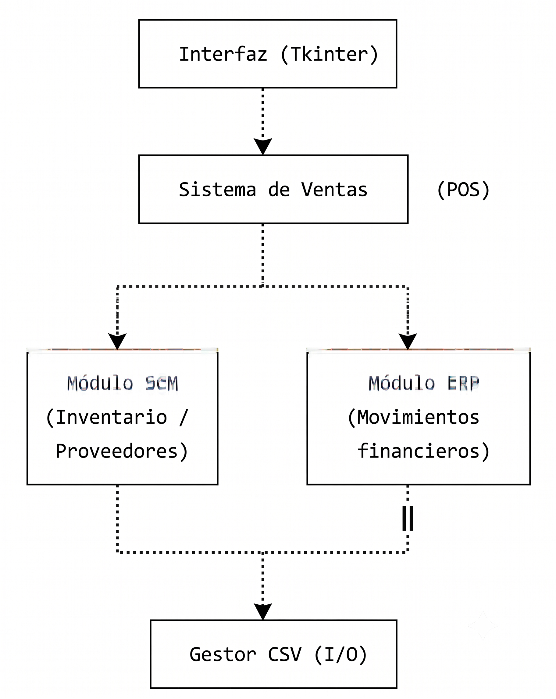

# 🛒 QuickMarket

> **ESCUELA POLITÉCNICA NACIONAL**
> Facultad de Ingeniería de Sistemas
> **ISID223 – Introducción a los Sistemas de Información**
>
> **Proyecto Final — Transformación Digital Empresarial**
> Sistema integrado de ventas, ERP, SCM y análisis RFM para un minimarket local
>
> **Carrera:** Ingeniería en Ciencia de Datos e Inteligencia Artificial
> 
> **Integrantes:**
> - Edwin Daniel Paredes
> - Jordy Sebastián Tipantuña
>
> **Grupo / Paralelo:** GR1CD
> **Docente:** Ing. Iván Carrera

---

Sistema de gestión para minimarket desarrollado en Python, que integra un módulo de **Punto de Venta (POS)**, un **ERP financiero simplificado** y un módulo de **SCM (inventario y proveedores)**, con una **interfaz gráfica en Tkinter**, un **dashboard gerencial** y **segmentación de clientes RFM** (Recencia, Frecuencia, Monto).

Este proyecto simula, a pequeña escala, la integración de tres sistemas empresariales típicos (POS, ERP y SCM) que en la vida real suelen estar separados, mostrando cómo una venta puede disparar automáticamente movimientos financieros y ajustes de inventario, como parte del proceso de **transformación digital empresarial** de un minimarket local.

---

## 📋 Tabla de contenidos


- [📄 Ver informe en PDF](Informe_Final_QuickMarket.pdf)
- [Características](#-características)
- [Arquitectura general](#-arquitectura-general)
- [Requisitos](#-requisitos)
- [Estructura del proyecto](#-estructura-del-proyecto)
- [Instalación y ejecución](#-instalación-y-ejecución)
- [Uso básico](#-uso-básico)
- [Datos](#-datos)

---

## ✨ Características

- 🖥️ **Interfaz gráfica (Tkinter)** con campos de búsqueda y autocompletado para productos y clientes (sin necesidad de recordar IDs).
- 🛒 **Módulo de ventas (POS)**: registro de ventas, cálculo automático de impuestos y totales.
- 📦 **Módulo SCM**: control de inventario en tiempo real, generación automática de órdenes de compra cuando el stock baja del mínimo configurado.
- 💰 **Módulo ERP**: registro automático de movimientos financieros (ingresos) por cada venta realizada.
- 📊 **Dashboard gerencial**: KPIs clave (ventas totales, número de ventas, ticket promedio), estado del inventario y gráficos de barras con colores diferenciados.
- 🎯 **Análisis RFM**: segmentación de clientes según Recencia, Frecuencia y Monto de compra, útil para estrategias de marketing/fidelización.
- 💾 **Persistencia en CSV**: no requiere base de datos ni instalación de motores externos, ideal para fines académicos o prototipos.
- 📁 **Carga de histórico académico**: importación inicial de datos desde un dataset público de ventas de supermercado.
- ✅ **Prueba de integración incluida**: valida automáticamente el flujo completo POS → SCM → ERP.
- 🧩 **Cero dependencias externas**: 100% biblioteca estándar de Python.

---

## 🏗️ Arquitectura general



Cada venta registrada en el POS dispara automáticamente:
1. El descuento de stock en el módulo SCM (y una orden de compra si el stock queda bajo el mínimo).
2. El registro del ingreso correspondiente en el módulo ERP.

---

## 🔧 Requisitos

- **Python 3.10 o superior** (el proyecto usa sintaxis moderna como `str | None`)
- **Tkinter** (incluido en la mayoría de instalaciones de Python; en Linux puede requerir instalarse aparte):
  ```bash
  sudo apt install python3-tk
  ```

No se necesitan librerías externas ni `pip install`: el proyecto usa únicamente la biblioteca estándar de Python.

---

## 📁 Estructura del proyecto

```
QuickMarket_001/
├── main.py                    # Punto de entrada de la aplicación
├── config.py                  # Configuración general (rutas, constantes)
├── inicializador.py           # Carga de datos iniciales e importación del histórico
├── interfaz.py                # Interfaz gráfica (Tkinter)
├── dashboard.py                # Dashboard gerencial y cálculo de KPIs
├── sistema_ventas.py           # Lógica del POS y coordinación ERP/SCM
├── modulo_erp.py                # Módulo financiero (ingresos, movimientos)
├── modulo_scm.py                 # Módulo de inventario y órdenes de compra
├── analisis_rfm.py                # Segmentación de clientes (RFM)
├── analisis_dataset.py             # Resumen estadístico del histórico
├── gestor_csv.py                    # Capa de persistencia en CSV
├── modelos.py                        # Clases de dominio (Cliente, Producto, Venta, etc.)
├── prueba_integracion.py              # Prueba automática del flujo POS -> SCM -> ERP
└── datos/                              # Archivos CSV (datos operativos y dataset histórico)
    ├── clientes.csv
    ├── productos.csv
    ├── proveedores.csv
    ├── ventas.csv
    ├── detalle_ventas.csv
    ├── ordenes_compra.csv
    ├── detalle_ordenes_compra.csv
    ├── movimientos_financieros.csv
    ├── segmentos_rfm.csv
    └── historico_supermarket.csv
```

---

## 🚀 Instalación y ejecución

1. Clona el repositorio:
   ```bash
   git clone https://github.com/<tu-usuario>/QuickMarket.git
   cd QuickMarket/QuickMarket_001
   ```

2. (Opcional pero recomendado) Crea un entorno virtual:
   ```bash
   python -m venv venv
   source venv/bin/activate   # En Windows: venv\Scripts\activate
   ```

3. Ejecuta la aplicación:
   ```bash
   python main.py
   ```

Al iniciar por primera vez, el sistema crea automáticamente los archivos CSV necesarios en `datos/` y carga datos de ejemplo (proveedores, productos y consumidor final), además de importar el histórico académico si está disponible.

---

## 🖱️ Uso básico

1. Al abrir la aplicación, usa el campo de búsqueda para seleccionar un **cliente** (o el consumidor final por defecto).
2. Busca y agrega **productos** al carrito escribiendo parte del nombre.
3. Selecciona el **método de pago** (Efectivo, Tarjeta, Transferencia, Billetera electrónica).
4. Confirma la venta: el sistema descontará el stock, generará el movimiento financiero correspondiente y, si aplica, creará una orden de compra automática.
5. Desde el **dashboard**, consulta KPIs de ventas, estado del inventario y segmentación RFM de clientes.

---

## 📊 Datos

Los datos de ejemplo y el histórico (`datos/historico_supermarket.csv`) provienen de un dataset académico público de ventas de supermercado, usado únicamente con fines de práctica y demostración dentro del curso ISID223. La tasa de impuesto definida en `config.py` es simulada y **no representa una regla tributaria oficial**.

---
